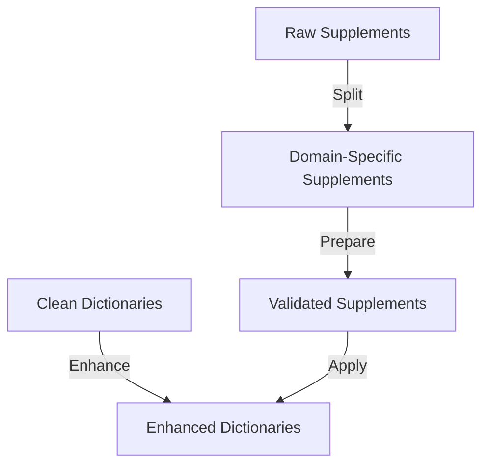

# Enhancements 🚀

Enhancement packages provide functionality to improve or augment data and processes. Each package implements specific enhancement logic to add value to the existing data or workflow.

---

📅 **Build Date:** [INSERT_DATE_HERE]

This category was last updated on the date above.  
For reproducibility and support, always refer to this date when sharing logs or output.

## 📋 Development Checklist

### 1. File Structure ✅
- [x] Standard package layout
  - [x] __init__.py with version info
  - [x] __main__.py for CLI
  - [x] tool.py for core functionality
  - [x] utils.py for helpers
  - [x] supplements/ directory
  - [x] README.md
- [x] Clean organization
- [x] No deprecated files

### 2. Documentation 🔄
- [x] Version information
- [x] Package-level docstring
- [x] Function docstrings
- [x] Type hints
- [x] README.md
- [ ] API documentation (needs improvement)
- [ ] Error code reference (needs standardization)
- [ ] Troubleshooting guide (needs creation)

### 3. Code Implementation ✅
- [x] Core functionality
- [x] CLI interface
- [x] Error handling
- [x] Input validation
- [x] Type checking
- [x] Performance optimization
- [x] Security considerations

### 4. Testing 🔄
- [ ] Unit tests (needs implementation)
- [ ] Integration tests (needs implementation)
- [ ] Performance tests (needs implementation)
- [ ] Edge case tests (needs implementation)
- [ ] Error condition tests (needs implementation)
- [x] Test data examples

### 5. Error Handling 🔄
- [x] Custom exceptions
- [x] Error messages
- [x] Error logging
- [ ] Error recovery (needs standardization)
- [x] Input validation

### 6. Performance ✅
- [x] Large dataset testing
- [x] Memory optimization
- [x] Progress reporting
- [x] Chunked processing
- [x] Performance metrics

### 7. Configuration ✅
- [x] Command-line arguments
- [x] Configuration validation
- [x] Environment variables
- [x] Default settings
- [x] Documentation

### 8. Packaging ✅
- [x] Dependencies specified
- [x] Version information
- [x] Package structure
- [x] Installation tested
- [x] Distribution tested

---

## 📋 Current Status and Future Improvements

### ✅ Completed Items
1. **Core Implementation**
   - All packages follow standard structure
   - Base enhancement class integration
   - Error handling foundations
   - Configuration management
   - CLI interfaces

2. **Documentation**
   - Main README structure
   - Package-level documentation
   - Function docstrings
   - Type hints

3. **Infrastructure**
   - Common utilities
   - Error handling
   - Configuration
   - Package organization

### 🔄 Partially Complete
1. **Testing**
   - ❌ Need unit tests
   - ❌ Need integration tests
   - ❌ Need performance tests
   - ✅ Test data examples

2. **Error Handling**
   - ✅ Basic error types
   - ✅ Error messages
   - ❌ Need standardized error codes
   - ❌ Need recovery procedures

3. **Documentation**
   - ✅ Basic documentation
   - ❌ Need API documentation
   - ❌ Need troubleshooting guides
   - ❌ Need error code reference

### 🎯 Prioritized Improvements

#### High Priority
1. **Testing Infrastructure**
   - Implement unit tests
   - Add integration tests
   - Create test suites
   - Add test documentation

2. **Error Handling**
   - Create standardized error codes
   - Implement recovery procedures
   - Document error patterns
   - Add error handling examples

3. **Documentation**
   - Create API documentation
   - Add troubleshooting guides
   - Create error code reference
   - Add usage examples

#### Medium Priority
4. **Maintenance**
   - Add code comments
   - Improve error messages
   - Update documentation
   - Refine configuration

## 📦 Available Enhancements

1. **Supplement Splitter** 📑
   - Splits merged supplements by domain
   - Uses cleaned dictionaries for validation
   - [Detailed Documentation](supplement_splitter/README.md)

2. **Supplement Prepper** 🧹
   - Merges and cleans supplement files
   - Prepares data for splitting
   - [Detailed Documentation](supplement_prepper/README.md)

3. **Dictionary Supplementer** 📚
   - Applies domain supplements to dictionaries
   - Enhances dictionary content
   - [Detailed Documentation](dictionary_supplementer/README.md)

## 🔄 Enhancement Flow



## 📋 Package Status Overview

### ✅ Common Strengths
1. **Core Functionality**
   - Standard file structure
   - Basic error handling
   - Input validation
   - Progress tracking
   - Logging system

2. **Documentation**
   - Detailed READMEs
   - Usage examples
   - Error solutions
   - Performance metrics

3. **Testing**
   - Unit test structure
   - Test data organization
   - Basic integration tests
   - Sample data provided

### 🔄 Shared Areas for Improvement
1. **Pipeline Integration**
   - ✅ Basic data flow
   - ✅ Error passing
   - ❌ State management
   - ❌ Recovery mechanisms

2. **Testing Coverage**
   - ✅ Unit tests
   - ✅ Basic integration
   - ❌ End-to-end tests
   - ❌ Performance benchmarks

3. **Error Handling**
   - ✅ Basic error types
   - ✅ Error messages
   - ❌ Automatic recovery
   - ❌ Pipeline rollback

## 🎯 Package-Level Roadmap

### High Priority
1. **Pipeline Robustness**
   - Add state management system
   - Implement pipeline rollback
   - Add recovery mechanisms
   - Create validation checkpoints

2. **Testing Infrastructure**
   - Add end-to-end pipeline tests
   - Create performance benchmarks
   - Add stress testing
   - Improve test data coverage

3. **Error Recovery**
   - Implement automatic recovery
   - Add state preservation
   - Create rollback mechanisms
   - Enhance error reporting

### Medium Priority
4. **Performance**
   - Add parallel processing
   - Implement chunked operations
   - Optimize memory usage
   - Add progress tracking

5. **Documentation**
   - Create pipeline tutorials
   - Add troubleshooting guides
   - Document common patterns
   - Create development guides

### Low Priority
6. **Monitoring**
   - Add pipeline metrics
   - Create health checks
   - Implement logging aggregation
   - Add performance tracking

7. **Development Tools**
   - Create enhancement templates
   - Add development utilities
   - Implement debugging tools
   - Add profiling support

## 🆕 Creating a New Enhancement

1. Create a new directory:
   ```bash
   mkdir scripts/enhancements/your_enhancement_name
   ```

2. Create required files:
   ```
   your_enhancement_name/
   ├── __init__.py     # Package interface
   ├── main.py         # Core implementation
   ├── utils.py        # Helper functions
   └── README.md       # Documentation
   ```

3. Implement your enhancement:
   ```python
   from common.base import BaseEnhancement

   class YourEnhancement(BaseEnhancement):
       def enhance(self, data: Any, **kwargs) -> Any:
           # Implement enhancement logic
           pass

       def validate(self, data: Any) -> bool:
           # Implement validation
           pass
   ```

## 🔧 Best Practices

1. Follow the pipeline architecture
2. Validate inputs and outputs
3. Handle errors gracefully
4. Implement proper logging
5. Add appropriate CLI arguments
6. Document usage and examples
7. Maintain test coverage
8. Consider memory usage
9. Use type hints
10. Keep dependencies updated

## 🤝 Contributing

1. Choose an area from the roadmap
2. Create a feature branch
3. Follow enhancement guidelines
4. Update documentation
5. Add/update tests
6. Submit for review

For detailed status and improvements for each enhancement, refer to their individual README files. 