# Checkers 🔍

Checker packages validate specific aspects of data or system state. Each checker implements a specific validation logic and returns a boolean result indicating pass/fail.

---

📅 **Build Date:** [INSERT_DATE_HERE]

This category was last updated on the date above.  
For reproducibility and support, always refer to this date when sharing logs or output.

---

## 📦 Project Structure

```
checkers/
├── __init__.py                    # Package interface and version info
├── example_checker.py             # Example checker implementation
├── README.md                      # This documentation
├── dictionary_driven_checker/     # Dictionary validation
│   ├── __init__.py
│   ├── tool.py
│   └── README.md
├── feature_change_checker/        # Feature change tracking
│   ├── __init__.py
│   ├── tool.py
│   └── README.md
├── release_consistency_checker/   # Release consistency validation
│   ├── __init__.py
│   ├── tool.py
│   └── README.md
└── score_totals_checker/         # Score calculation validation
    ├── __init__.py
    ├── tool.py
    └── README.md
```

## 🔄 Package Relationships

```mermaid
graph TD
    DDC["Dictionary Driven<br/>Checker 📚"]
    FCC["Feature Change<br/>Checker 📊"]
    RCC["Release Consistency<br/>Checker 🔄"]
    STC["Score Totals<br/>Checker 🔢"]
    RD["Raw Data"]
    DD["Data<br/>Dictionary"]
    
    RD -->|"validates"| DDC
    DD -->|"provides rules"| DDC
    RD -->|"tracks changes"| FCC
    RD -->|"checks consistency"| RCC
    RD -->|"validates scores"| STC
```



## 📋 Common Features

All checker packages share these core features:
1. Boolean validation result
2. Detailed error messages
3. Progress reporting
4. Error handling
5. Batch processing
6. Configuration options

## 🛠️ Creating a New Checker

1. Create a new directory for your checker:
   ```bash
   mkdir scripts/checkers/your_checker_name
   ```

2. Create the following files in your checker directory:
   ```
   your_checker_name/
   ├── __init__.py         # Package interface and version info
   ├── __main__.py         # CLI entry point
   ├── tool.py            # Core implementation
   ├── utils.py           # Checker-specific utilities
   ├── tests/             # Test suite
   │   ├── __init__.py
   │   ├── test_integration.py
   │   └── test_tool.py
   └── README.md         # Documentation
   ```

3. Implement your checker by inheriting from `BaseChecker`:
   ```python
   from common.base import BaseChecker

   class YourChecker(BaseChecker):
       def check(self, data: Any, **kwargs) -> bool:
           # Implement your check logic here
           pass

       def get_error_message(self) -> str:
           return "Your error message here"
   ```

## 🎯 Best Practices

1. Keep each checker focused on a single validation concern
2. Provide clear error messages that help identify the issue
3. Include proper logging for debugging
4. Add appropriate CLI arguments for configuration
5. Document usage and examples in your checker's README
6. Follow the standardized checklist in your README
7. Maintain test coverage for core functionality
8. Consider performance with large datasets
9. Use type hints and docstrings
10. Keep dependencies documented

## 📋 Development Checklist

### 1. File Structure ✅
- [x] Standard package layout
  - [x] __init__.py with version info
  - [x] __main__.py for CLI
  - [x] tool.py for core functionality
  - [x] utils.py for helpers
  - [x] tests/ directory (in most packages)
  - [x] README.md
- [x] Clean organization
- [x] No deprecated files

### 2. Documentation 🔄
- [x] Version information
- [x] Package-level docstring
- [x] Function docstrings
- [x] Type hints
- [x] README.md
- [ ] API documentation (needs improvement)
- [ ] Error code reference (needs standardization)
- [ ] Troubleshooting guide (needs creation)

### 3. Code Implementation ✅
- [x] Core functionality
- [x] CLI interface
- [x] Error handling
- [x] Input validation
- [x] Type checking
- [x] Performance optimization
- [x] Security considerations

### 4. Testing 🔄
- [x] Unit tests (in packages with tests/ directory)
- [ ] Integration tests (needs implementation)
- [ ] Performance tests (needs implementation)
- [x] Edge case tests (in existing test suites)
- [x] Error condition tests (in existing test suites)
- [x] Test data examples

### 5. Error Handling 🔄
- [x] Custom exceptions
- [x] Error messages
- [x] Error logging
- [ ] Error recovery (needs standardization)
- [x] Input validation

### 6. Performance 🔄
- [ ] Large dataset testing (needs implementation)
- [x] Memory optimization
- [x] Progress reporting
- [x] Chunked processing
- [ ] Performance metrics (needs implementation)

### 7. Configuration ✅
- [x] Command-line arguments
- [x] Configuration validation
- [x] Environment variables
- [x] Default settings
- [x] Documentation

### 8. Packaging ✅
- [x] Dependencies specified
- [x] Version information
- [x] Package structure
- [x] Installation tested
- [x] Distribution tested

---

## 📋 Current Status and Future Improvements

### ✅ Completed Items
1. **Core Implementation**
   - All packages follow standard structure
   - Base checker class integration
   - Error handling foundations
   - Configuration management
   - CLI interfaces

2. **Documentation**
   - Main README structure
   - Package-level documentation
   - Function docstrings
   - Type hints

3. **Infrastructure**
   - Common utilities
   - Error handling
   - Configuration
   - Package organization

### 🔄 Partially Complete
1. **Testing**
   - ✅ Unit test framework in most packages
   - ✅ Basic test data
   - ❌ Need integration tests
   - ❌ Need performance tests

2. **Error Handling**
   - ✅ Basic error types
   - ✅ Error messages
   - ❌ Need standardized error codes
   - ❌ Need recovery procedures

3. **Performance**
   - ✅ Basic optimizations
   - ✅ Progress reporting
   - ❌ Need benchmarking
   - ❌ Need large dataset testing

### 🎯 Prioritized Improvements

#### High Priority
1. **Testing Infrastructure**
   - Implement integration tests
   - Add performance tests
   - Create benchmarking suite
   - Standardize test data

2. **Error Handling**
   - Create standardized error codes
   - Implement recovery procedures
   - Document error patterns
   - Add error handling examples

3. **Documentation**
   - Create API documentation
   - Add troubleshooting guides
   - Create error code reference
   - Add performance guidelines

#### Medium Priority
4. **Performance**
   - Implement benchmarking
   - Add large dataset tests
   - Create performance metrics
   - Document optimization patterns

## 🤝 Contributing

1. Branch naming: `checker/[name]-[feature]`
2. Required tests:
   - Unit tests for core logic
   - Integration tests
3. Documentation:
   - Update README
   - Document features
   - Update patterns
4. Code review checklist in CONTRIBUTING.md 