# Tools 🛠️

Tool packages provide standalone utilities and automation scripts. Each package implements specific functionality to assist with various tasks in the data processing pipeline.

---

📅 **Build Date:** [INSERT_DATE_HERE]

This category was last updated on the date above.  
For reproducibility and support, always refer to this date when sharing logs or output.

## 📋 Development Checklist

### 1. File Structure ✅
- [x] Standard package layout
  - [x] __init__.py with version info
  - [x] __main__.py for CLI
  - [x] tool.py for core functionality
  - [x] utils.py for helpers
  - [x] plugins/ directory (where needed)
  - [x] README.md
  - [x] README_devs.md (where needed)
- [x] Clean organization
- [x] No deprecated files

### 2. Documentation ✅
- [x] Version information
- [x] Package-level docstring
- [x] Function docstrings
- [x] Type hints
- [x] README.md
- [x] API documentation
- [x] Error code reference
- [x] Troubleshooting guide

### 3. Code Implementation ✅
- [x] Core functionality
- [x] CLI interface
- [x] Error handling
- [x] Input validation
- [x] Type checking
- [x] Performance optimization
- [x] Security considerations

### 4. Testing 🔄
- [ ] Unit tests (needs implementation)
- [ ] Integration tests (needs implementation)
- [ ] Performance tests (needs implementation)
- [ ] Edge case tests (needs implementation)
- [ ] Error condition tests (needs implementation)
- [x] Test data examples

### 5. Error Handling ✅
- [x] Custom exceptions
- [x] Error messages
- [x] Error logging
- [x] Error recovery
- [x] Input validation

### 6. Performance ✅
- [x] Large dataset testing
- [x] Memory optimization
- [x] Progress reporting
- [x] Chunked processing
- [x] Performance metrics

### 7. Configuration ✅
- [x] Command-line arguments
- [x] Configuration validation
- [x] Environment variables
- [x] Default settings
- [x] Documentation

### 8. Packaging ✅
- [x] Dependencies specified
- [x] Version information
- [x] Package structure
- [x] Installation tested
- [x] Distribution tested

---

## 📋 Current Status and Future Improvements

### ✅ Completed Items
1. **Core Implementation**
   - All packages follow standard structure
   - Base tool class integration
   - Error handling foundations
   - Configuration management
   - CLI interfaces

2. **Documentation**
   - Main README structure
   - Package-level documentation
   - Function docstrings
   - Type hints
   - Developer guides

3. **Infrastructure**
   - Common utilities
   - Error handling
   - Configuration
   - Package organization
   - Plugin system

### 🔄 Partially Complete
1. **Testing**
   - ❌ Need unit tests
   - ❌ Need integration tests
   - ❌ Need performance tests
   - ✅ Test data examples

2. **Error Handling**
   - ✅ Basic error types
   - ✅ Error messages
   - ✅ Error codes
   - ✅ Recovery procedures

3. **Documentation**
   - ✅ Basic documentation
   - ✅ API documentation
   - ✅ Troubleshooting guides
   - ✅ Error code reference

### 🎯 Prioritized Improvements

#### High Priority
1. **Testing Infrastructure**
   - Implement unit tests
   - Add integration tests
   - Create test suites
   - Add test documentation

2. **Performance**
   - Add benchmarking
   - Optimize large datasets
   - Monitor memory usage
   - Profile critical paths

3. **Maintenance**
   - Regular updates
   - Bug fixes
   - Security patches
   - Dependency updates

#### Medium Priority
4. **Enhancements**
   - Add new features
   - Improve UX
   - Extend plugin system
   - Add automation

## 📦 Package Overview

This category contains the following tool packages:

1. **Automated Labeler** 🏷️
   - Automates data labeling tasks
   - Uses machine learning models
   - Supports manual review
   - Handles batch processing

2. **RHQ Form Autofiller** 📝
   - Automates form filling
   - Validates input data
   - Generates reports
   - Supports templates

3. **Data Content Comparer** 🔍
   - Compares data content
   - Identifies differences
   - Generates reports
   - Supports multiple formats

## 🔄 Package Relationships

```mermaid
graph TD
    AL["Automated<br/>Labeler 🏷️"]
    RF["RHQ Form<br/>Autofiller 📝"]
    DC["Data Content<br/>Comparer 🔍"]
    RD["Raw Data"]
    TD["Tool<br/>Dispatcher"]
    
    RD -->|"labels"| AL
    RD -->|"fills forms"| RF
    RD -->|"compares"| DC
    TD -->|"dispatches"| AL
    TD -->|"dispatches"| RF
    TD -->|"dispatches"| DC
```



## 📋 Common Features

All tool packages share these core features:
1. Command-line interface
2. Python API
3. Progress reporting
4. Error handling
5. Batch processing
6. Configuration options

## 🛠️ Creating a New Tool

1. Create a new directory for your tool:
   ```bash
   mkdir scripts/tools/your_tool_name
   ```

2. Create the following files in your tool directory:
   ```
   your_tool_name/
   ├── __init__.py         # Package interface and version info
   ├── __main__.py         # CLI entry point
   ├── tool.py            # Core implementation
   ├── utils.py           # Tool-specific utilities
   ├── tests/             # Test suite
   │   ├── __init__.py
   │   ├── test_integration.py
   │   └── test_tool.py
   └── README.md         # Documentation
   ```

3. Implement your tool by inheriting from `BaseTool`:
   ```python
   from common.base import BaseTool

   class YourTool(BaseTool):
       def run(self, **kwargs) -> Any:
           # Implement your tool logic here
           pass

       def validate_input(self, **kwargs) -> bool:
           # Validate input parameters
           return True
   ```

## 🎯 Best Practices

1. Focus on automation
   - Clear task definition
   - Minimal user interaction
   - Progress feedback

2. Provide user feedback
   - Clear progress indicators
   - Error messages
   - Success confirmation

3. Implement error handling
   - Input validation
   - Error recovery
   - State preservation

4. Include comprehensive testing
   - Unit tests
   - Integration tests
   - User interaction tests

5. Optimize performance
   - Efficient algorithms
   - Resource management
   - Progress reporting

6. Document thoroughly
   - Usage examples
   - Configuration options
   - Error reference
   - Performance guidelines 