# Transformers 🔄

Transformer packages modify and standardize data formats. Each package implements specific transformation logic to convert data from one format to another or to clean and standardize data.

---

📅 **Build Date:** [INSERT_DATE_HERE]

This category was last updated on the date above.  
For reproducibility and support, always refer to this date when sharing logs or output.

## 📋 Development Checklist

### 1. File Structure ✅
- [x] Standard package layout
  - [x] __init__.py with version info
  - [x] __main__.py for CLI
  - [x] tool.py for core functionality
  - [x] utils.py for helpers (where needed)
  - [x] README.md
- [x] Clean organization
- [x] No deprecated files

### 2. Documentation 🔄
- [x] Version information
- [x] Package-level docstring
- [x] Function docstrings
- [x] Type hints
- [x] README.md
- [ ] API documentation (needs improvement)
- [ ] Error code reference (needs standardization)
- [ ] Troubleshooting guide (needs creation)

### 3. Code Implementation ✅
- [x] Core functionality
- [x] CLI interface
- [x] Error handling
- [x] Input validation
- [x] Type checking
- [x] Performance optimization
- [x] Security considerations

### 4. Testing 🔄
- [ ] Unit tests (needs implementation)
- [ ] Integration tests (needs implementation)
- [ ] Performance tests (needs implementation)
- [ ] Edge case tests (needs implementation)
- [ ] Error condition tests (needs implementation)
- [x] Test data examples

### 5. Error Handling 🔄
- [x] Custom exceptions
- [x] Error messages
- [x] Error logging
- [ ] Error recovery (needs standardization)
- [x] Input validation

### 6. Performance ✅
- [x] Large dataset testing
- [x] Memory optimization
- [x] Progress reporting
- [x] Chunked processing
- [x] Performance metrics

### 7. Configuration ✅
- [x] Command-line arguments
- [x] Configuration validation
- [x] Environment variables
- [x] Default settings
- [x] Documentation

### 8. Packaging ✅
- [x] Dependencies specified
- [x] Version information
- [x] Package structure
- [x] Installation tested
- [x] Distribution tested

---

## 📋 Current Status and Future Improvements

### ✅ Completed Items
1. **Core Implementation**
   - All packages follow standard structure
   - Base transformer class integration
   - Error handling foundations
   - Configuration management
   - CLI interfaces

2. **Documentation**
   - Main README structure
   - Package-level documentation
   - Function docstrings
   - Type hints

3. **Infrastructure**
   - Common utilities
   - Error handling
   - Configuration
   - Package organization

### 🔄 Partially Complete
1. **Testing**
   - ❌ Need unit tests
   - ❌ Need integration tests
   - ❌ Need performance tests
   - ✅ Test data examples

2. **Error Handling**
   - ✅ Basic error types
   - ✅ Error messages
   - ❌ Need standardized error codes
   - ❌ Need recovery procedures

3. **Documentation**
   - ✅ Basic documentation
   - ❌ Need API documentation
   - ❌ Need troubleshooting guides
   - ❌ Need error code reference

### 🎯 Prioritized Improvements

#### High Priority
1. **Testing Infrastructure**
   - Implement unit tests
   - Add integration tests
   - Create test suites
   - Add test documentation

2. **Error Handling**
   - Create standardized error codes
   - Implement recovery procedures
   - Document error patterns
   - Add error handling examples

3. **Documentation**
   - Create API documentation
   - Add troubleshooting guides
   - Create error code reference
   - Add usage examples

#### Medium Priority
4. **Maintenance**
   - Add code comments
   - Improve error messages
   - Update documentation
   - Refine configuration

## 📦 Package Overview

This category contains the following transformer packages:

1. **Date Format Standardizer** 📅
   - Standardizes date formats across datasets
   - Handles multiple input formats
   - Validates date values
   - Configurable output formats

2. **Dictionary Cleaner** 🧹
   - Cleans and standardizes dictionary files
   - Removes invalid entries
   - Standardizes formats
   - Validates relationships

## 🔄 Package Relationships

```mermaid
graph TD
    DFS["Date Format<br/>Standardizer 📅"]
    DC["Dictionary<br/>Cleaner 🧹"]
    DD["Domain<br/>Dictionaries"]
    RD["Raw Data"]
    
    RD -->|"standardizes<br/>dates"| DFS
    DD -->|"cleans"| DC
    DC -->|"provides clean<br/>dictionaries"| DFS
```



## 📋 Common Features

All transformer packages share these core features:
1. Data format conversion
2. Value standardization
3. Data validation
4. Error reporting
5. Batch processing support

## 🛠️ Creating a New Transformer

1. Create a new directory for your transformer:
   ```bash
   mkdir scripts/transformers/your_transformer_name
   ```

2. Create the following files in your transformer directory:
   ```
   your_transformer_name/
   ├── __init__.py         # Package interface and version info
   ├── __main__.py         # CLI entry point
   ├── transformer.py      # Core implementation
   ├── utils.py           # Transformer-specific utilities
   ├── tests/             # Test suite
   │   ├── __init__.py
   │   ├── test_integration.py
   │   └── test_transformer.py
   └── README.md         # Documentation
   ```

3. Implement your transformer by inheriting from `BaseTransformer`:
   ```python
   from common.base import BaseTransformer

   class YourTransformer(BaseTransformer):
       def transform(self, data: Any, **kwargs) -> Any:
           # Implement your transformation logic here
           pass

       def validate_output(self, output: Any) -> bool:
           # Validate transformed output
           return True
   ```

## 🎯 Best Practices

1. Focus on data transformation
   - Clear input/output formats
   - Validation at each step
   - Error handling for edge cases

2. Provide detailed error messages
   - Clear error descriptions
   - Data location information
   - Suggested fixes

3. Implement robust error handling
   - Graceful failure modes
   - State preservation
   - Recovery mechanisms

4. Include comprehensive testing
   - Unit tests for transformations
   - Integration tests
   - Edge case coverage

5. Optimize performance
   - Efficient algorithms
   - Memory management
   - Progress reporting

6. Document thoroughly
   - Input/output formats
   - Transformation rules
   - Usage examples
   - Performance guidelines 